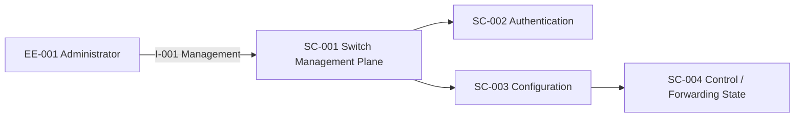

# Example — Managed Industrial Ethernet Switch

## Skill Execution
Skill Execution: Product Threat Modeling v1.0.0

- Mode: Product Mode
- Product Profiles: Network Device + Embedded/IoT + Industrial/OT
- Threat Knowledge Candidates: ATT&CK Enterprise/Network Devices + ATT&CK for ICS + CAPEC
- Weakness Knowledge: CWE only when a weakness is supported

AP-001:
`Management Reachability → Credential Abuse → Administrative Session → Configuration Tampering → Network Disruption`

T-001:
An attacker obtains or guesses administrative credentials and changes security/network configuration.

- STRIDE: Spoofing / Tampering / Elevation of Privilege
- Cyber Impact: administrative identity/configuration compromise
- Operational Impact: forwarding/redundancy/segmentation disruption
- Physical/Safety Impact: only if a supported causal path to the controlled process exists
- Recoverability: trusted admin path + known-good configuration restore

Knowledge mapping should be performed only after verifying current official CAPEC/ATT&CK sources.
